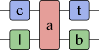

#  Catlab.jl

Catlab.jl is a framework for applied and computational category theory, written
in the [Julia](https://julialang.org) language. Catlab provides a programming
library and interactive interface for applications of category theory to
scientific and engineering fields. It emphasizes monoidal categories due to
their wide applicability but can support any categorical structure that is
formalizable as a generalized algebraic theory.

## Getting started

The [documentation](https://algebraicjulia.github.io/Catlab.jl/latest) contains
several example notebooks, as well as partial API docs. However, we readily
acknowledge that the documentation is not as well developed as it should be.
Feel free to ask questions! Besides the GitHub issues, we have a
[#catlab.jl](https://julialang.zulipchat.com/#narrow/stream/230248-catlab.2Ejl)
stream on the [Julia Zulip](https://julialang.zulipchat.com/) (preferred) and
also a [#catlab](https://julialang.slack.com/archives/CQNUDDF5L) channel on the
[Julia Slack](https://julialang.org/slack/) (less preferred).

### Contributing

Applied category theory is a young and growing field, and Catlab is too the
subject of ongoing research and development. This means that there are lots of
opportunities to do new and interesting things!

We welcome contributions to Catlab, regardless of your experience level with
category theory or the Julia language. For more information, see the
[CONTRIBUTING](CONTRIBUTING.md) file.

## What is Catlab?

Catlab is, or will eventually be, the following things.

**Programming library**: First and foremost, Catlab provides data structures,
algorithms, and serialization for applied category theory. Macros offer a
convenient syntax for specifying categorical doctrines and type-safe symbolic
manipulation systems. Wiring diagrams (aka string diagrams) are supported
through specialized data structures and can be serialized to and from GraphML
(an XML-based format) and JSON.

**Interactive computing environment**: Catlab can also be used interactively in
[Jupyter notebooks](http://jupyter.org). Symbolic expressions are displayed
using LaTeX and wiring diagrams are visualized using
[Compose.jl](https://github.com/GiovineItalia/Compose.jl),
[Graphviz](http://www.graphviz.org), or [TikZ](https://github.com/pgf-tikz/pgf).

**Computer algebra system**: Catlab will serve as a computer algebra system for
categorical algebra. Unlike most computer algebra systems, all expressions are
typed using fragment of dependent type theory called [generalized algebraic
theories](https://ncatlab.org/nlab/show/generalized+algebraic+theory). We will
implement core algorithms for solving word problems and reducing expressions to
normal form with respect to several important doctrines, such as those of
categories and of symmetric monoidal categories. For the computer algebra of
classical abstract algebra, see
[AbstractAlgebra.j](https://github.com/wbhart/AbstractAlgebra.jl) and
[Nemo.jl](https://github.com/wbhart/Nemo.jl).

### What is Catlab not?

Catlab is *not* currently any of the following things, although we do not rule
out that it could eventually evolve in these directions.

**Automated theorem prover**: Although there is some overlap between computer
algebra and automated theorem proving, Catlab cannot be considered a theorem
prover because it does not produce formal certificates of correctness
(aka proofs).

**Proof assistant**: Likewise, Catlab is not a proof assistant because it does
not produce formally verifiable proofs. Formal verification is not within scope
of the project.

**Graphical user interface**: Catlab does not provide a wiring diagram editor
or other graphical user interface. It is primarily a programming library, not a
user-facing application. However, it could be used as the backend for such an
application.
